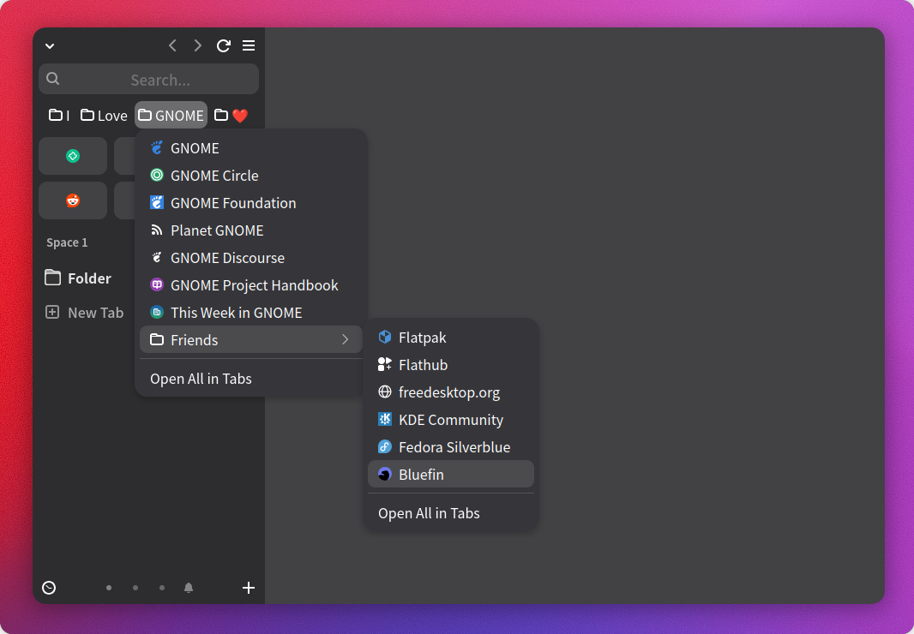
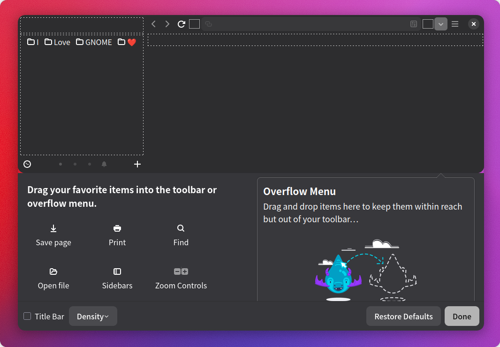
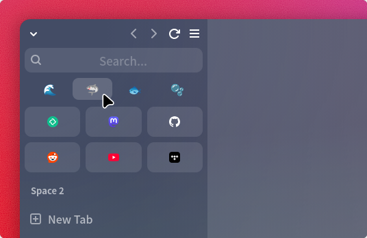

# Zen 側邊欄書籤列

[正體中文](README.zh-TW.md) | [English](README.md)

一個允許將書籤列顯示在 Zen 瀏覽器側邊欄的 CSS 模組。



## 📦 安裝步驟

1. 下載本儲存庫。
2. 找到使用者設定檔中的 `chrome` 目錄。
3. 將 `userChrome.css` 檔案和 `mods` 資料夾放至 `chrome` 目錄中。
4. 重啟瀏覽器。

## ✏️ 使用方式

1. 在工具列點擊右鍵，選擇`自訂工具列…`。
2. 將`書籤工作列項目`拖放到側邊欄的中間區塊上方。
3. 點擊右下角的`完成`結束設定。

> [!NOTE]
> 可能不太容易一次就拖放到正確的位置。可以先拖放到該區塊內，再移動到上方，多試幾次！
> 
> 如果`書籤工作列項目`按鈕消失了，可以切換到其他分頁再切換回來，或是重新開啟`自訂工具列…`頁面即可恢復。



## ⚙️ 額外選項

這裡有一些選項，可供個人依自身喜好調整。

方法很簡單，只需打開 `about:config` 頁面，新增對應條目並保持在 `true` 即可。若要關閉，可切換到 `false`，或是直接刪除該條目。

- **隱藏資料夾圖標：**當你使用 Emoji 當作資料夾名稱，希望有更簡潔的顯示效果時，這會有所幫助。

   ```
   zen.sidebar.bookmarks.hide-folder-icon
   ```

   

- **顯示更多選單：**如果你有非常多資料夾，希望放不下的資料夾可以移動到更多選單中，這會有幫助。

   ```
   zen.sidebar.bookmarks.overflow
   ```

   啟用後，書籤列會靠左對齊，並將超過側邊欄寬度的項目移動到更多選單。

## 😞 已知限制

- 切換工作區時，由於書籤列會被重新定位，而顯示極短暫的閃爍，我暫時還找不到辦法解決。
- 不建議將書籤列以外的按鈕拖放到此區域中，會有一些視覺上的故障。
- 很可能與其他使用此區塊的 CSS 模組不相容。

## ❓ 不起作用？

- 請確定已為 Zen 瀏覽器開啟 `userChrome.css` 支援：

   1. 在網址列輸入 `about:config` 並按下 `Enter`。
   2. 搜尋  `toolkit.legacyUserProfileCustomizations.stylesheets` 並將其切換為	`true`。

- 確定將檔案放入了正確的使用者設定檔：

   1. 在網址列輸入 `about:support` 並按下 `Enter`。
   2. 尋找「應用程式一般資訊」中的「設定檔目錄」項目。
   3. 按下「開啟資料夾」。這將會開啟 Zen 瀏覽器儲存您使用者設定檔的目錄。

> 以上教學來自 Zen 的官方文檔： [Live Editing Zen Theme](https://docs.zen-browser.app/guides/live-editing)

## 📄 License

本專案基於 MIT License 條款開源。
